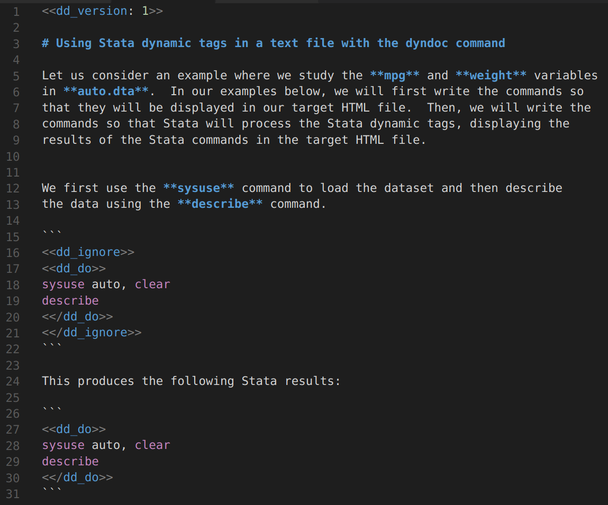

# Stata language support in Atom
[](https://atom.io/packages/language-stata)
[](https://atom.io/packages/language-stata)
[](https://github.com/kylebarron/language-stata/blob/master/LICENSE)

[](https://github.com/kylebarron/language-stata)
[](https://github.com/kylebarron/language-stata)

- [News](#news)
- [Features](#features)
- [Installation](#installation)
- [Dynamic Documents](#dynamic-documents)
- [Running Code](#running-code)

## News

- Support added for [Dynamic Documents](#dynamic-documents)
- The [stata-exec](https://atom.io/packages/stata-exec) package has been updated and now makes it extremely easy to run code line-by-line in Stata on Windows, macOS, and Linux.

Also [available for Visual Studio Code](https://marketplace.visualstudio.com/items?itemName=kylebarron.stata-enhanced).


Code snippet (mostly) from [Gtools](https://github.com/mcaceresb/stata-gtools), a faster implementation of Stata's collapse and egen using C plugins. Shown with the [Atom Material Syntax](https://github.com/atom-material/atom-material-syntax) theme and [Fira Code](https://github.com/tonsky/FiraCode) font.

## Features

This package highlights:

- System commands, functions, and function arguments
- Macros, both global and local
    - Accurately colors nested macros and escaped macros in strings when you want the inner macro to evaluate at runtime
    - Colors macro extended functions inside `` `: ... '`` as well as after `local lname:`
- Regular expressions
    - Colors both the limited syntax provided through the `regexr()` and `regexm()` functions, as well as the vastly expanded regex syntax provided in Stata 14 and 15 through the `ustrregexm()`, `ustrregexrf()`, and `ustrregexra()` functions.
- Dynamic Markdown and LaTeX documents. [Instructions below.](#dynamic-documents)

Other nice features:

- Autocomplete for built-in commands and functions, and for your macros as you write them.
- Alerts you if your variable name is illegal, i.e. if your variable name is more than 32 chars, starts with a number, or is a reserved name.
- Alerts you if you have any text other than } on a line ending a foreach/forvalues/if/else command
- Local macro back tick autocompletion. When you write a `, Atom automatically fills in a ' after your cursor
- Makes it easy to spot incorrect nesting of compound quotes
- Support for programming ligatures for all valid Stata syntax for fonts that support them, like the [Fira Code](https://github.com/tonsky/FiraCode) font.
- Highlights SQL queries used in the [`odbc`](https://www.stata.com/help.cgi?odbc) command. (The `language-sql` base package must be active.)
- Highlights [Docblockr](https://atom.io/packages/docblockr)-style keywords inside comments (anything like `@Note`)

## Installation

To install, do one of the following:

- Go to Preferences/Settings > Install > Packages; and then search for `language-stata`
- At the command line, type `apm install language-stata`

The local macro back tick autocompletion won't function until you fully restart Atom. Do `ctrl-shift-P` or `cmd-shift-P` to bring up the command palette, type `Window: Reload`, and click enter.

## Dynamic Documents



Stata 15 brought new features for working with dynamic documents. The [`dyndoc`](https://www.stata.com/help.cgi?dyndoc) command lets you write in Markdown and converts your file and code to HTML for viewing in a web browser.

It also added the [`dyntext`](https://www.stata.com/help.cgi?dyntext) command, which fills in Stata output for any text file, without touching the text itself. This lets you then use third-party document generators like [Pandoc](https://pandoc.org/) and [LaTeX](https://www.latex-project.org/) to generate documents.

This package now provides syntax highlighting for Stata code written inside Stata's [dynamic tags](https://www.stata.com/help.cgi?dynamic+tags) for Markdown and LaTeX documents.

By default, this package's Markdown and LaTeX syntax highlighting will be applied for files ending in `.domd` and `.dotex` respectively. **The [language-markdown](https://atom.io/packages/language-markdown) and [language-latex](https://atom.io/packages/language-latex) packages must be installed for the highlighting to work.**

If you name your file with a different extension, you can manually set the highlighting by clicking on the "Plain Text" button on the bottom right of the screen (or by pressing <kbd>CTRL</kbd>+<kbd>SHIFT</kbd>+<kbd>L</kbd>) and then selecting `Stata Dyndoc (Markdown)` or `Stata Dyndoc (LaTeX)` from the drop-down menu.

### Examples

An example of the PDF output of using `dyntext` and Pandoc is in the examples folder: [`dyntext.pdf`](examples/dyntext.pdf).

That file was created by running

```stata
dyntext dyntext.domd, saving(dyntext.md) replace
```
from inside Stata 15, and then with

```
pandoc dyntext.md -o dyntext.pdf
```

on the command line using [Pandoc](https://pandoc.org/).

The file [`dyntext.dotex`](examples/dyntext.dotex) is a proof-of-concept and should compile with LaTeX but the output is not shown here.

## Running Code

The [`stata-exec`](https://atom.io/packages/stata-exec) package has functionality to run Stata code on Window, macOS, and Linux.

